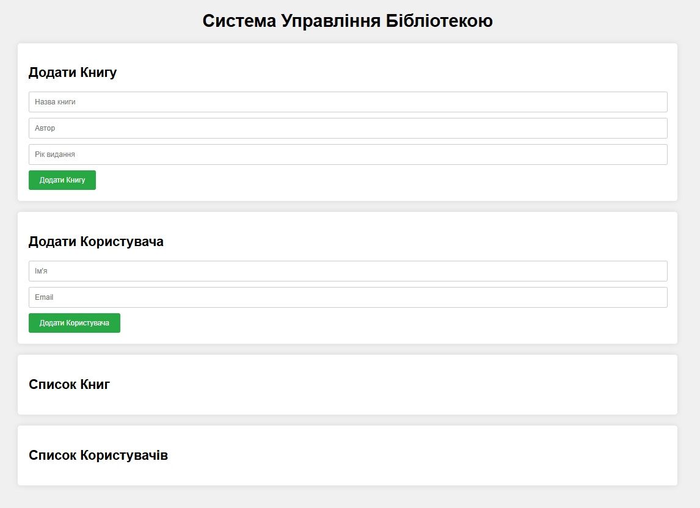
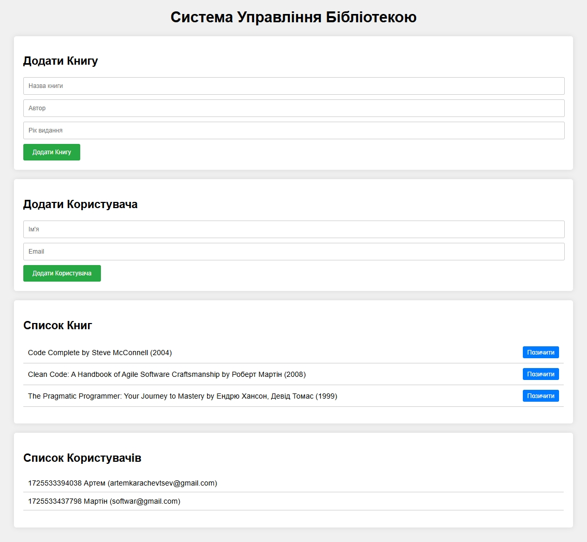
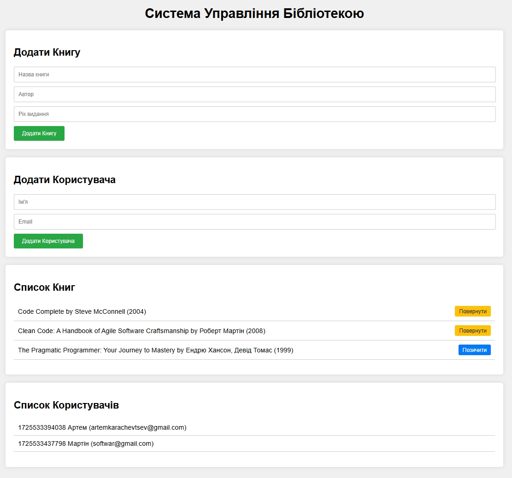
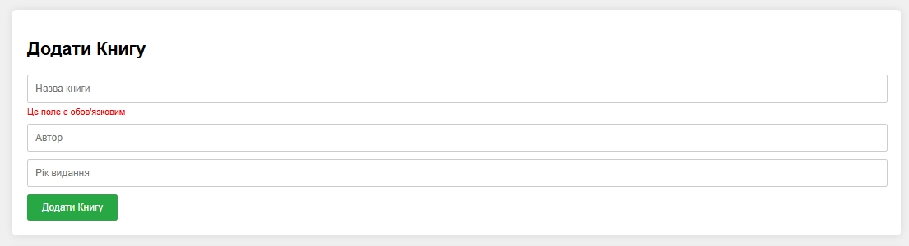
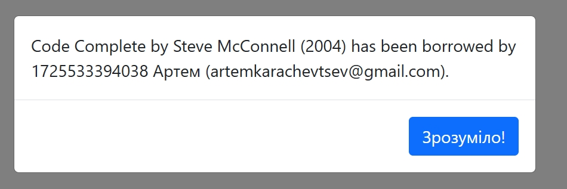
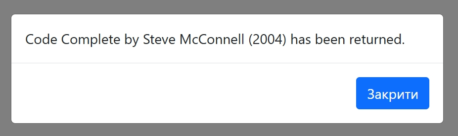

= Лабораторна робота №2

*Тема:* розробка клієнтського застосунку управління бібліотекою.

*Мета:* розробити клієнтський застосунок для управління бібліотекою, яка дозволяє вести облік книг та користувачів, а також здійснювати операції з позичання та повернення книг.
Програма має бути реалізована з використанням можливостей TypeScript, таких як класи, інтерфейси, generics, модулі та простори імен.

== Вимоги до звіту:

. Дана лабораторна робота виконується в окремому репозиторії
. Застосунок будується виключно засобами JS/TS - жодної декларативної розмітки в `index.html` (лише `

` ).
. Весь UI генерується та оновлюється програмно (DOM API/рендер-функціями)
. Дотримання TypeScript-типізації
. Використання класи та інтерфейси
. Використання Generics
. Використання модулів та простір імен
. Дотримання Feature branch workflow
. Дотримання https://www.conventionalcommits.org/[Conventional commits specification]
. Для стилізації використовувати Bootstrap або Tailwind, підключений через відповідний бандлер
. Код має бути читабельним, дотримуватись єдиного стилю (ESLint + Prettier) і добре організованим
. Ключові методи класів `Library` та `Validation` мають бути покриті юніт-тестами (Mocha)
. Перед кожним комітом мають автоматично запускатись лінтер та тести (Husky)
. Код повинен бути розміщений в особистому GitHub репозиторії студента

== Рекомендована архітектура проєкту

Код рекомендується розділяти за шарами відповідальності, а не за типами файлів:

[source]
----
lab-app/
├── src/
│   ├── models/                 # чисті дані + типи/інтерфейси
│   │   ├── Book.ts
│   │   ├── User.ts
│   │   └── interfaces/
│   │       ├── IBook.ts
│   │       └── IUser.ts
│   │
│   ├── services/                # бізнес-логіка
│   │   ├── Library.ts           # generic-клас Library<T>
│   │   ├── Storage.ts           # робота з LocalStorage
│   │   └── NotificationService.ts
│   │
│   ├── utils/                    # чисті допоміжні функції
│   │   ├── validators.ts         # Validation namespace/функції
│   │   └── idGenerator.ts
│   │
│   ├── ui/                       # рендер і DOM-логіка (без розмітки в html!)
│   │   ├── components/
│   │   │   ├── BookForm.ts
│   │   │   ├── BookList.ts
│   │   │   ├── UserForm.ts
│   │   │   └── Modal.ts
│   │   └── render.ts             # точки монтування, оновлення DOM
│   │
│   ├── types/                     # спільні типи, enum-и, глобальні d.ts
│   │   └── index.ts
│   │
│   ├── styles/                    # якщо є власні стилі поверх UI-фреймворку
│   │   └── main.scss
│   │
│   └── index.ts                   # точка входу, збирає все разом
│
├── tests/
│   ├── library.test.ts
│   └── validation.test.ts
│
├── public/
│   └── favicon.ico                 # статичні файли, які доступні користувачам напряму
│                                   # через інтернет без обробки сервером чи бекенд-кодом
│
├── index.html                 # тільки 

│
│
├── .eslintrc.json
├── .prettierrc
├── .husky/
│   └── pre-commit
├── webpack.config.js
├── vite.config.ts                 # в окремій гілці
├── tsconfig.json
├── package.json
└── README.md
----

Принципи розділення:

* `models` не знають про UI чи storage - лише типи й дані з геттерами/сеттерами, що спрощує тестування.
* `services` містять Generics (`Library<T>`) та роботу зі станом і LocalStorage; не чіпають DOM.
* `utils/validators.ts` - природне місце для `namespace Validation { ... }`.
* `ui/` - єдиний шар, що працює з DOM; решта коду про DOM нічого не знає.
* `tests/` винесені окремо від `src/` для зручності конфігурації Mocha.
* Конфігурації збірки (`webpack.config.js`, `vite.config.ts`) не лежать усередині `src/` і розводяться по гілках згідно з завданням щодо Vite.

== Практична частина

. Самостійно ініціалізувати проєкт (`npm init`) та встановити всі необхідні залежності (TypeScript, webpack, webpack-cli, webpack-dev-server, loaders/plugins тощо).
Готового набору залежностей не надається - конфігурацію `package.json` студент формує сам.
. Ознайомитись із приблизною архітектурою проєкту (директорія app-library) та орієнтовним дизайном UI (директорія app-design)
. Самостійно налаштувати `webpack.config.js` використовуючи офіційну документацію.
Налаштувати вхідну точку, вихідну директорію, обробку `.ts`-файлів (`ts-loader`), обробку стилів, `devServer` для запуску через `npm run start` (http://localhost:9000 або інший вільний порт).
. Підключити обраний UI-фреймворк, як залежність через npm та імпортувати його стилі/скрипти через webpack (а не підключенням CDN-посилань у `index.html`).
. У директорії app-design знаходиться приблизний вигляд UI застосунку - орієнтуватись на нього при верстці.
. Реалізувати вигляд UI застосунку з використанням обраного UI-фреймворку, генеруючи розмітку виключно з коду.
+

+

. Реалізувати класи та інтерфейси для книг.
Додайте методи для доступу до властивостей книги.
. Реалізувати класи та інтерфейси для користувачів.
Додайте методи для доступу до властивостей користувача.
. Реалізувати клас `Library`, який буде використовувати Generics для управління колекцією об'єктів типу T. Додайте до класу методи для додавання, видалення та пошуку об'єктів у колекції.
. Реалізувати клас `Storage`, який буде зберігати, видаляти та очищати LocalStorage.
. Розбийте вашу програму на кілька модулів: models, services, utils, modals, validation і т.д. У кожному модулі реалізуйте відповідні класи та функції.
Продумайте модульну структуру вашого застосунку.
Використовуйте простори імен для організації коду всередині модулів, якщо це необхідно.
. Реалізуйте функції для позичання книги та повернення книги.
Ці функції повинні змінювати стан книги (наприклад, позначати, що вона вже взята).
+

. Додайте валідацію введених даних при створенні книг та користувачів.
Всі поля повинні бути обов'язковими для заповнення.
Поле з id користувача - тільки цифри.
Поле "Рік видання" - тільки цифри, додати регулярку на перевірку, що це має бути рік.
Виводити клієнту відповідні помилки.
+

. Реалізуйте систему сповіщень (використання alert заборонено), яка буде інформувати користувача про бажання позичати книгу, успішне позичання або повернення книги.
Кожен юзер може позичити не більше 3-х книг.
Якщо юзер захоче обрати четверту, вивести йому відповідне повідомлення (модальне вікно).
+

. Всі введені дані зберігати в LocalStorage, тобто при перезавантаженні сторінки списки повинні зберігатись.
. Впровадити ESLint та Prettier.
Додати конфігураційні файли (`.eslintrc`, `.prettierrc`), налаштувати правила для TypeScript, усунути всі попередження лінтера в коді.
. Впровадити автоматичне тестування за допомогою Mocha (+ Chai для асертів).
Написати юніт-тести для ключових методів класів `Library` (додавання, видалення, пошук об'єктів) та `Validation` (перевірка обов'язкових полів, id користувача, року видання).
Додати npm-скрипт `test`.
. Налаштувати Husky (`pre-commit` hook).
Перед кожним комітом мають автоматично запускатись ESLint та тести Mocha; коміт має блокуватись, якщо перевірки не пройшли.

. Реалізувати функцію для пошуку книг за автором або назвою.
. Реалізувати видалення книг, юзерів.
. Реалізувати пагінацію для списків книг та авторів (наприклад, якщо список книг 40, то виводити 5 книг на сторінку).
. В окремій гілці (наприклад, `vite-migration`) замінити webpack на Vite: видалити `webpack.config.js` та відповідні залежності, самостійно налаштувати `vite.config.ts` (dev-сервер, збірка, обробка TS та стилів UI-фреймворку) так, щоб застосунок працював ідентично до webpack-версії.
. Зробити деплой обох варіантів (або фінальної гілки) на gh-pages.
. Написати ґрунтовний висновок (у звіті/README), що порівнює webpack та Vite за цим проєктом: швидкість старту dev-сервера та HMR, час і складність налаштування конфігурації, розмір і швидкість продакшн-збірки, зручність підключення UI-фреймворку та TS-лоадерів, екосистема плагінів, суб'єктивна оцінка зручності для подібних невеликих SPA-проєктів.

== Контрольні питання

. Які переваги дає використання TypeScript порівняно зі звичайним JavaScript при розробці великого застосунку?
. У чому різниця між класом та інтерфейсом у TypeScript?
Наведіть приклад, коли варто використати саме інтерфейс.
. Що таке Generics і навіщо вони використані саме в класі Library?
Що було б втрачено, якби Library не був узагальненим (generic)?
. Поясніть різницю між модулями (ES-модулями) та просторами імен (namespaces) у TypeScript.
Коли доречно використовувати namespace всередині модуля?
. Як організована модульна структура проєкту (models, services, utils)?
Яку відповідальність несе кожен із цих шарів?
. Як реалізовано збереження та відновлення даних через клас Storage і LocalStorage?
Які обмеження має LocalStorage як сховище даних?
. Опишіть логіку методів позичання (borrow) та повернення (return) книги.
Які стани книги вони змінюють і як це відображається в UI?
. Як реалізована валідація форм (обов'язкові поля, id користувача, рік видання)?
Яким чином регулярний вираз перевіряє коректність року?
. Яке обмеження накладено на кількість одночасно позичених книг одним користувачем і як застосунок повідомляє про перевищення ліміту?
. Чому в цій роботі заборонено писати декларативну розмітку в index.html, і як натомість генерується DOM-структура застосунку?
. За що відповідає webpack.config.js у проєкті?
Назвіть щонайменше три ключові налаштування, які ви виконали самостійно (entry, output, loaders, devServer тощо).
. Яку роль виконують ESLint та Prettier у проєкті та в чому принципова різниця між їхніми задачами?
. Що тестують юніт-тести для класів Library та Validation за допомогою Mocha?
Наведіть приклад тест-кейсу для одного з методів.
. Як працює Husky pre-commit hook у цьому проєкті і яку проблему він вирішує в командній розробці?
. У чому основні відмінності між webpack та Vite (за результатами вашого порівняння на окремій гілці) — за швидкістю запуску dev-сервера, налаштуванням конфігурації та розміром продакшн-збірки?
